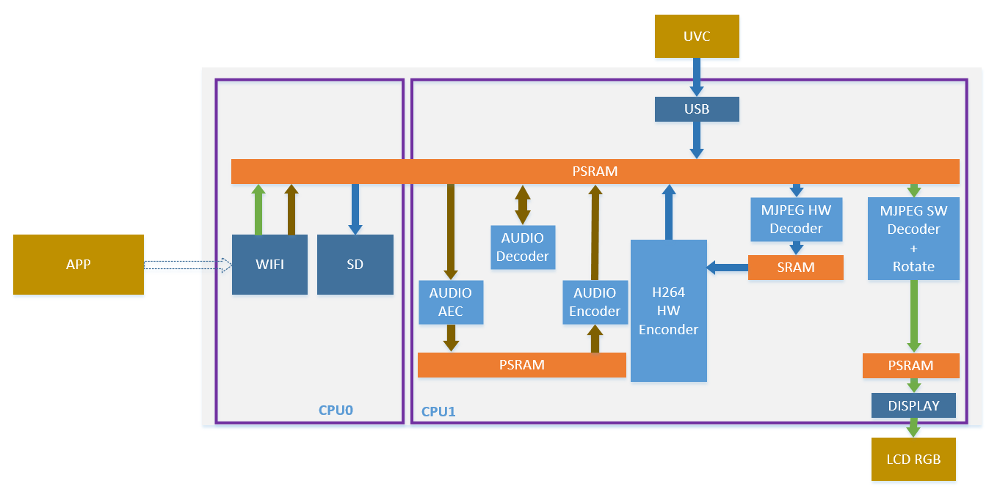
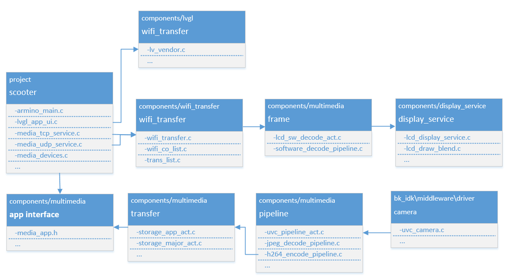

两轮车工程
=================================

:link_to_translation:`en:[English]`

1. 简介
---------------------------------

本工程是两轮车工程，使用WIFI导航同时保存行车记录数据；

1.1 规格
,,,,,,,,,,,,,,,,,,,,,,,,,,,,,,,,,

	* 硬件配置：
		* 核心板，**BK7258_QFN88_9X9_V3.2**
		* 显示转接板，**BK7258_LCD_Interface_V3.0**
		* 麦克小板，**BK_Module_Microphone_V1.1**
		* 喇叭小板，**BK_Module_Speaker_V1.1**
		* PSRAM 8M/16M
		* UVC Camera

1.2 路径
,,,,,,,,,,,,,,,,,,,,,,,,,,,,,,,,,

	工程路径: ``<bk_dashcam源代码路径>/project/scooter``

	project编译指令: ``make bk7258 PROJECT=scooter``

2. 框架图
---------------------------------

2.1 软件模块架构图
,,,,,,,,,,,,,,,,,,,,,,,,,,,,,,,,,

    软件模块架构如下图所示：

    Figure 1. software module architecture

..

    * 两轮车方案中，APP将导航图像和导航语音发送到设备端进行导航；
    * 两轮车方案中，UVC摄像头采集的数据经过H264编码后存储到SD卡上，保存行车记录；

2.2 代码模块关系图
,,,,,,,,,,,,,,,,,,,,,,,,,,,,,,,,,

    如下图所示，方案使用的多媒体的接口，都定义在 **media_app.h** 中。

    Figure 2. module relationship diagram

3. 演示说明
---------------------------------

方案中导航功能和行车记录功能可单独使用

3.1 导航功能
,,,,,,,,,,,,,,,,,,,,,,,,,,,,,,,,,

打开导航功能共三步，根据需求板子可以使用AP模式或STA模式

板子使用AP模式::

    步骤一：通过命令打开板子WIFI；命令为“test ap“；
    步骤二：手机连接板子WIFI，wifi名“bicycle“，wifi密码”12345678”；
    步骤三：手机端打开两轮车对应的APP，将导航图像投屏到设备端；

板子使用STA模式::

    步骤一：手机打开热点，设置热点名“bicycle“，wifi密码”12345678”；
    步骤二：通过命令打开板子WIFI，自动连接"bicycle"；命令为“test sta“，自动连接WIFI "bicycle"；
    步骤三：手机端打开两轮车对应的APP，将导航图像投屏到设备端；

3.2 行车记录功能
,,,,,,,,,,,,,,,,,,,,,,,,,,,,,,,,,

打开行车记录功能前需要确保SD卡能正常被读取；

通过以下两条命令测试::

    步骤一：输入命令加载SD卡，命令为“fatfstest M 1“
    步骤二：输入命令读取SD卡中文件目录，命令为“fatfstest S 1“

上述两个步骤中没有出现fail log，并且能够打印出SD卡中的文件名，说明SD卡能正常读取；

打开行车记录功能::

    步骤一：输入命令打开UVC摄像头，命令为“media uvc open 1280X720“
    步骤二：输入命令打开H264模块进行编码，命令为“media pipeline h264_open“
    步骤三：输入命令打开自动录制，命令为“media save_auto 15 10000“
        其中10000表示每10000ms的数据存储到一个文件中；
        15表示每15个文件进行循环；
        文件名默认为auto_0.h264， auto_1.h264，…， auto_15.h264

关闭行车记录功能::

    输入命令关闭自动录制，命令为“media save_stop 1“
    
关闭UVC摄像头和H264视频编码::

    步骤一：输入命令关闭H264模块，命令为“media pipeline h264_close“
    步骤二：输入命令关闭UVC摄像头，命令为“media uvc close“
